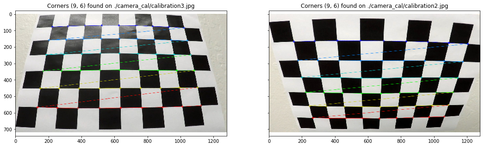
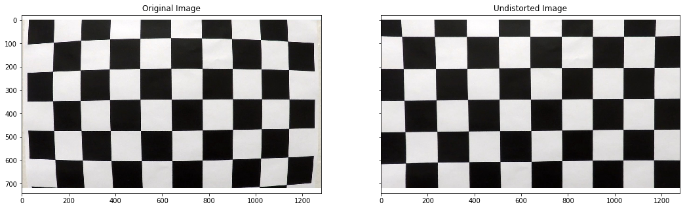
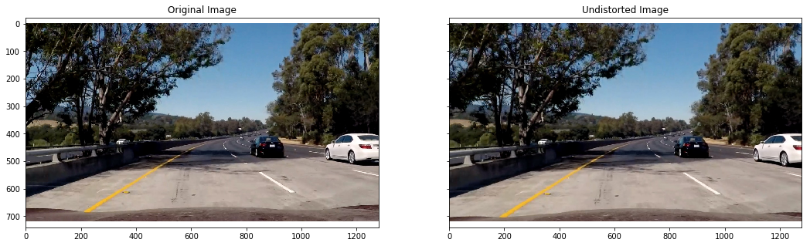
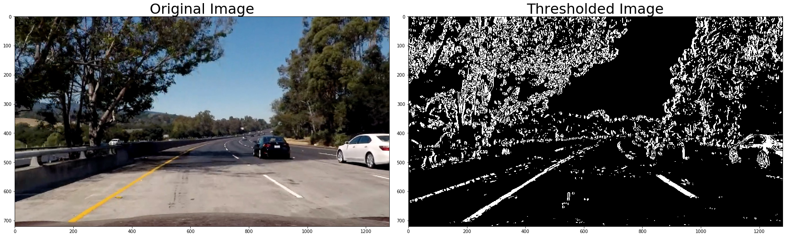
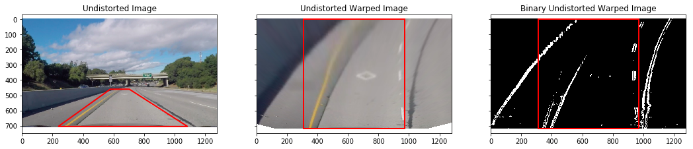
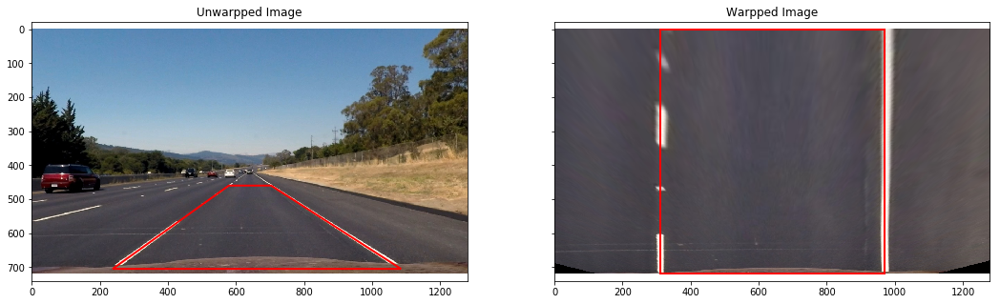
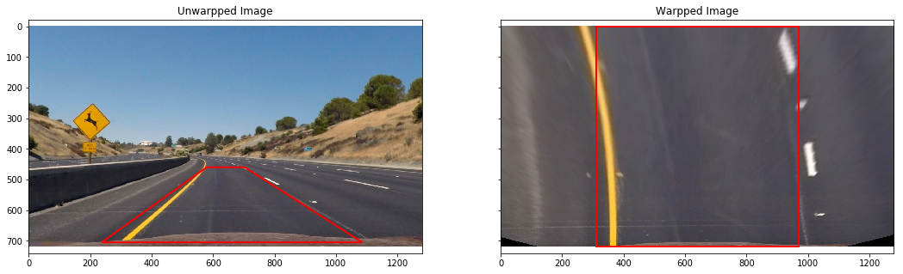
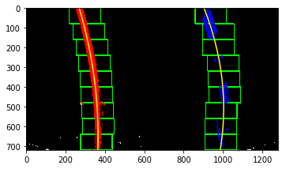
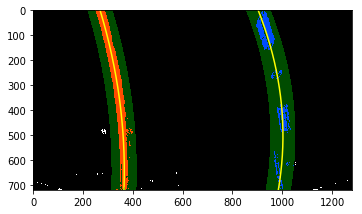
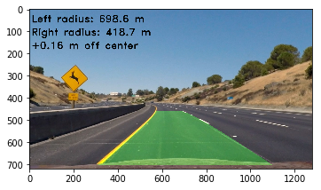

# Advanced Lane Finding Project

## The goals / steps of this project are the following:

* Compute the camera calibration matrix and distortion coefficients given a set of chessboard images.
* Apply a distortion correction to raw images.
* Use color transforms, gradients, etc., to create a thresholded binary image.
* Apply a perspective transform to rectify binary image ("birds-eye view").
* Detect lane pixels and fit to find the lane boundary.
* Determine the curvature of the lane and vehicle position with respect to center.
* Warp the detected lane boundaries back onto the original image.
* Output visual display of the lane boundaries and numerical estimation of lane curvature and vehicle position.

[//]: # (Image References)

[image1]: ./examples/undistort_output.png "Undistorted"
[image2]: ./test_images/test1.jpg "Road Transformed"
[image3]: ./examples/binary_combo_example.jpg "Binary Example"
[image4]: ./examples/warped_straight_lines.jpg "Warp Example"
[image5]: ./examples/color_fit_lines.jpg "Fit Visual"
[image6]: ./examples/example_output.jpg "Output"
[video1]: ./project_video.mp4 "Video"

## [Rubric](https://review.udacity.com/#!/rubrics/571/view) Points

### Here I will consider the rubric points individually and describe how I addressed each point in my implementation.

---

### Writeup / README

#### 1. Provide a Writeup / README that includes all the rubric points and how you addressed each one.  You can submit your writeup as markdown or pdf.  [Here](https://github.com/udacity/CarND-Advanced-Lane-Lines/blob/master/writeup_template.md) is a template writeup for this project you can use as a guide and a starting point.

You're reading it!

### Camera Calibration

#### 1. Briefly state how you computed the camera matrix and distortion coefficients. Provide an example of a distortion corrected calibration image.

The code for this step is contained in the cells under header **1. Camera Calibration** of file "P4.ipynb".

This step can be largely separated into step small steps:
- Setup the 3d-2d mapping by finding chessboard corners
- Calibration the camera
- Undistort an image

I start by preparing "object points", which will be the (x, y, z) coordinates of the chessboard corners in the world.
Here I am assuming the chessboard is fixed on the (x, y) plane at z=0, such that the object points are the same for each calibration image.
Thus, `objp` is just a replicated array of coordinates, and `objpoints` will be appended with a copy of it every time I successfully detect all chessboard corners in a test image.
`imgpoints` will be appended with the (x, y) pixel position of each of the corners in the image plane with each successful chessboard detection.

Note that there are three images that are failed to find the chessboard corners.
I fix them manually by finding fewer corners.
Here is an example for finding chessboard corners:

<caption>
 **Fig. 1 Finding Chessboard Corners**  
</caption>

I then used the output `objpoints` and `imgpoints` to compute the camera calibration and distortion coefficients using the `cv2.calibrateCamera()` function.
I applied this distortion correction to the test image using the `cv2.undistort()` function and obtained this result:

<caption>
 **Fig. 2 Undistorted Chessboard**  
</caption>

### Pipeline (single images)

#### 1. Provide an example of a distortion-corrected image.

I use the same function to undistort the chessborad to do this step.
An example undistorted image is the following (more can be found in P4.ipynb):

<caption>
 **Fig. 3 Undistorted Image**  
</caption>

#### 2. Describe how (and identify where in your code) you used color transforms, gradients or other methods to create a thresholded binary image.  Provide an example of a binary image result.

I used a combination of color and gradient thresholds to generate a binary image as suggested in the lectures.
The code is in **3. Create Binary Image** of "P4.ipynb".
Basically I use the S channel of HLS color space and feed the L channel into the Sobel filter.
Here's an example of my output for this step.

<caption>
 **Fig. 4 Thresholded Binary Image**  
</caption>

As I approach the end of this project, I find the above color space might not be ideal for the "challenge_video.mp4".
The problem is that there are black tarmac lines near the traffic lanes.
Moreover, the shadows of barrier are also confusing.
Here is a snapshot at the beginning of the video:

<caption>
 **Fig. 5 Challenging Image**  
</caption>

A possible solution for this problem is to threshold channels of multiple color spaces.
For example, the V channel of LUV color space is suitable for yellow and S channel of HSV space is suitable for white.
Then we combine these two first and apply Sobel filter on this combined image.
However, this is not explored now.

#### 3. Describe how (and identify where in your code) you performed a perspective transform and provide an example of a transformed image.

The code for my perspective transform locates under section **2. Perspective Transform**.
Specifically, the function is called `warp()`, which takes an image (`img`), a set of source (`src`) points and a set of destination (`dst`) points, and then return the warped image.
I did not choose to hardcode the source and destination points.
Instead, I use the Canny edge detection code implemented in the previous lane finding project to detect the lines in "straightline2.jpg".

This resulted in the following source and destination points:

| Source        | Destination   |
|:-------------:|:-------------:|
| 237.8, 705    | 310, 720      |
| 1085.1, 705   | 970, 720      |
| 703.5, 460    | 970, 0        |
| 578.9, 460    | 310, 0        |

I verified that my perspective transform was working as expected by drawing the `src` and `dst` points onto a test image and its warped counterpart to verify that the lines appear parallel in the warped image.

<caption>
 **Fig. 6 Warped Image Straight Line**  
</caption>

<caption>
 **Fig. 7 Warped Image Curved Line**  
</caption>

#### 4. Describe how (and identify where in your code) you identified lane-line pixels and fit their positions with a polynomial?

This step is located in section **5. Find Lanes and Fit a Polynomial**, where I basically copy the code from the lectures.
The only difference is that I ignore 50 pixels of the left and right margins just in case the shadows of barrier are falsely identified as lanes.
The sliding window output looks like this:

<caption>
 **Fig. 8 Sliding Window**  
</caption>

<caption>
 **Fig. 9 Sliding Window Refined**  
</caption>

#### 5. Describe how (and identify where in your code) you calculated the radius of curvature of the lane and the position of the vehicle with respect to center.

The curvature is implemented in section **6. Measure and Draw Curvature**, specifically in the `compute_curvatures()` function.

#### 6. Provide an example image of your result plotted back down onto the road such that the lane area is identified clearly.

I implemented this step in `draw_curvature()` function of section **6. Measure and Draw Curvature**.
Here is an example of my result on a test image:

<caption>
 **Fig. 10 Final Output on a Single Image**  
</caption>

---

### Pipeline (video)

#### 1. Provide a link to your final video output.  Your pipeline should perform reasonably well on the entire project video (wobbly lines are ok but no catastrophic failures that would cause the car to drive off the road!).

Here's a [link to my video result](./test_videos_output/project_video.mp4).

---

### Discussion

#### 1. Briefly discuss any problems / issues you faced in your implementation of this project.  Where will your pipeline likely fail?  What could you do to make it more robust?

One issue I have implementing the pipeline is to figure out the various thresholds for the binary image.
At the end of the day, I tweaked the thresholds given in the lectures, which worked for the "project_video.mp4" video.

As mentioned before, towards the end of this project, I tried the "challenge_video.mp4" and the model does not work.
The problems were caused by mixed lane colors, shadows of trees or barriers.
It may be necessary to consider the yellow and white lines separately.
For example, yellow lines tend to have large values in the V channel of the LUV space, while white lines have very small values in the S channel of the HSV space.

I also note that the drastic changes of lighting conditions and sloping road in "harder_challenge_video.mp4" also lead to catastrophic failures.
The changes of lighting conditions may be alleviated if more frames are averaged.
The sloping road suggests several changes need to be made, such as the camera calibration and image masking.

The outlier rejection is not very strong in the current implementation.
Basically I refuse excessively large quadratic and linear coefficients in the polynomial fitting.
I also make sure consecutive frames should have a small difference in the x direction at the y midpoint.
The model could be more robust if a trust weight is added to each fitted curve and this weight could be related to curvature or a predefined function.

However, I think the most important thing in this project is to obtain good binary image, and I am not sure how to make it robust for all conditions.
